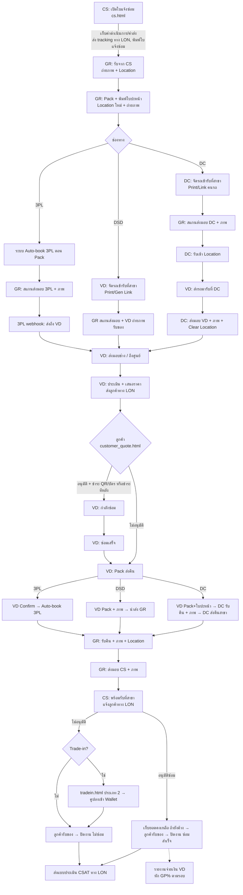

# 01 — ภาพรวมระบบ (System Overview)

## 1. เป้าหมาย

ระบบบริหารงานศูนย์บริการซ่อมของไทวัสดุ ครอบคลุมตั้งแต่ลูกค้านำสินค้ามาแจ้งซ่อมที่สาขา → ขนส่งไปศูนย์ซ่อม (VD) → เสนอราคา/ลูกค้าอนุมัติผ่าน LINE → ซ่อม → ส่งคืนสาขา → ลูกค้ารับของ/ทำ Trade-in → สรุปจ่ายเงิน VD และรายงานผู้บริหาร

**คุณค่าหลัก**
1. ติดตามทุกใบงานได้แบบ real-time ทุกจุดส่งมอบมี **ภาพถ่าย + ผู้ทำ + เวลา** (chain of custody)
2. จับ **SLA** ทุกขั้นตอน และชี้ได้ว่าส่วนงานไหนทำให้ล่าช้า (CS / GR / DC / VD / 3PL)
3. ลดงานคนกลาง: ลูกค้าอนุมัติ + ชำระเงินเองผ่านลิงก์ LINE, 3PL auto-book, คำนวณค่าธรรมเนียม/โปรอัตโนมัติ
4. ปิดวงจรการเงิน: เก็บเงินลูกค้า → หัก GP → จ่าย VD ตามรอบ
5. สร้างยอดขายใหม่จากงานที่ไม่คุ้มซ่อม (Trade-in)

## 2. ผู้ใช้งาน (Actors)

| Actor | ประเภท | ทำอะไร | Prototype |
|-------|--------|--------|-----------|
| Admin | Staff (HQ) | ตั้งค่า master data, เห็นทุกเมนู, dashboard ผู้บริหาร, ทำจ่าย VD | admin, exec, analytics, report |
| CS | Staff (สาขา) | เปิดใบแจ้งซ่อม, เก็บค่าดำเนินการ, คืนสินค้า, ปิดงาน, ออก Trade-in | cs, tradein |
| GR | Staff (สาขา) | รับของจาก CS, Pack, ส่งมอบขนส่ง, รับของคืน, ส่งมอบ CS | gr |
| DC | Staff (คลัง) | จัดรถรับจากสาขา, รับเข้า Location, ส่งมอบ VD, รับคืนจาก VD, ส่งคืนสาขา | dc |
| VD | Partner (ศูนย์ซ่อม) | รับงาน, ประเมิน/เสนอราคา, ซ่อม, Pack ส่งคืน | vd |
| S2 | Staff (สาขา) | เปิดงานซ่อมสินค้าสต็อกสาขา | s2 |
| Customer | Public (ไม่ login) | ดู tracking, อนุมัติ/ไม่อนุมัติใบเสนอราคา, ชำระเงิน, ประเมินความพึงพอใจ | customer_quote |
| Driver | Public (token link) | เปิดลิงก์งานรับ/ส่งสินค้าบนมือถือ | (ยังไม่มี prototype) |
| Executive | Staff (HQ) | ดู Executive Dashboard (ใน prototype ใช้ role Admin) | exec |
| ระบบภายนอก | Integration | LINE(LON), Payment Gateway, 3PL, POS, Wallet แอปไทวัสดุ, บัญชี | — |

## 3. ประเภทงาน (Job Types)

| ประเภท | เลขที่ | เปิดโดย | ลักษณะ |
|--------|-------|---------|--------|
| `CUSTOMER` งานซ่อมลูกค้า | `JB-YYMM-#####` | CS | มีลูกค้า, ค่าธรรมเนียม, ใบเสนอราคา, อนุมัติ, ชำระเงิน, ช่องทาง DSD/DC/3PL |
| `STOCK` งานซ่อมสต็อกสาขา | `STK-YYMM-#####` | S2 | ไม่มีลูกค้า/การเงิน, หลาย SKU ต่อใบ, ช่องทาง DC/DSD เท่านั้น, ข้ามขั้นตอนเสนอราคา |
| Trade-in (ไม่ใช่ job) | `TI-YYMM-#####` | CS | ประเภท 1 ไม่ผูก job / ประเภท 2 ผูก job ที่ไม่อนุมัติซ่อม |
| ใบเสนอราคา | `QT-YYMM-#####` | VD | ผูกกับ job |

`YYMM` = ปี ค.ศ. 2 หลัก + เดือน (เช่น `2609` = ก.ย. 2026) — running แยกตามประเภทและรีเซ็ตทุกเดือน

## 4. Flow ครบวงจร (ร้อยเรียงจากทุกหน้าจอ)

### 4.1 Customer Job — เส้นทางหลัก



### 4.2 เล่าเป็นขั้นตอน (ใคร-ทำอะไร-หลักฐาน)

| # | ส่วนงาน | ขั้นตอน | หลักฐาน/ข้อบังคับ | ผลลัพธ์ในระบบ |
|---|---------|---------|-------------------|----------------|
| 1 | CS | กรอกข้อมูลลูกค้า (ที่อยู่ lookup จากรหัสไปรษณีย์, ที่อยู่ใบกำกับภาษีแยกได้), สินค้า (SKU ไม่บังคับ, ชื่อ, แบรนด์, อาการ), ประกัน, ขนาด, วิธีจัดส่ง, ภาพ ≤4 + ตำหนิ | คำนวณค่าดำเนินการ/ค่าส่งอัตโนมัติ; ชำระ QR / ลิงก์บัตร / เลขใบเสร็จ POS | สร้าง Job, จับคู่ VD, กำหนด channel, ส่ง tracking LON, พิมพ์ใบแจ้งซ่อม+QR |
| 2 | GR | รับสินค้าจาก CS | ภาพ + Location **บังคับ** | stage `GR_RECEIVED` |
| 3 | GR | Pack ลงกล่อง | Location ใหม่ + ภาพ **บังคับ**; พิมพ์ใบปะหน้า (QR, เลขงาน, สินค้า, VD ปลายทาง) | `GR_PACKED`; ถ้า 3PL → auto-book |
| 4 | DC/VD/3PL | จัดรถเข้ารับ: DC หรือ VD กด Print เอกสาร / ส่ง Link ให้คนรถ | — | shipment `DISPATCHED` |
| 5 | GR | สแกนยืนยันส่งมอบให้ขนส่ง (แยกกลุ่ม DC / DSD / 3PL) | ภาพ **บังคับ** | `OUTBOUND_TO_DC` หรือ `OUTBOUND_TO_VD` |
| 6 | DC | (ช่อง DC) รับเข้า Location | Location **บังคับ** | `AT_DC_OUTBOUND` |
| 7 | DC | ส่งมอบให้ VD ที่มารับ + Clear Location | ภาพ **บังคับ** | `OUTBOUND_TO_VD` |
| 8 | VD | ยืนยันรับสินค้า/ส่งมอบช่าง (สแกน QR หรือคีย์เลขงาน); 3PL = webhook อัตโนมัติ | ภาพรับสินค้า (DSD) | `VD_INSPECTING` |
| 9 | VD | ประเมิน + เสนอราคา: ค่าเปิดเครื่อง (auto ตามประกัน), บรรทัดอะไหล่ (ราคา, รออะไหล่ วัน, รับประกัน วัน), ระยะเวลาซ่อม, รับประกันงานซ่อม → VAT 7% | ออกใบเสนอราคา `QT-` → ส่ง LON | `WAITING_APPROVAL` |
| 10 | ลูกค้า | เปิดลิงก์ → อนุมัติ (เลือกชำระ QR PromptPay / บัตร) หรือ ไม่อนุมัติ | — | `REPAIRING` หรือ `RETURN_PACKING` |
| 11 | VD | ซ่อม → กด "ซ่อมเสร็จ" | — | `RETURN_PACKING` |
| 12 | VD | Pack ส่งคืนตาม channel: DC (ภาพ+ใบปะหน้า) / DSD (ภาพ, ส่งมอบ GR) / 3PL (Confirm → auto-book) | ภาพ **บังคับ** (DC/DSD) | `INBOUND_TO_DC` / `INBOUND_TO_BRANCH` |
| 13 | DC | (ช่อง DC) รับคืนจาก VD → จัดรถส่งคืนสาขา (Print/Link) → ยืนยันจัดส่งออกจาก DC | ภาพรับคืน **บังคับ** | `AT_DC_INBOUND` → `INBOUND_TO_BRANCH` |
| 14 | GR | รับคืนจาก VD/DC/3PL | ภาพ + Location **บังคับ** | `GR_RETURN_RECEIVED` |
| 15 | GR | ส่งมอบให้ CS | ภาพ **บังคับ** | `READY_FOR_PICKUP` + แจ้งลูกค้า LON |
| 16 | CS | อนุมัติซ่อม: แสดงสรุปยอด (หักค่าดำเนินการเป็นส่วนลด), ดูใบเสนอราคา, เก็บยอดค้าง → ปิดงาน | ต้องชำระครบก่อนปิด | `CLOSED_REPAIRED` |
| 17 | CS | ไม่อนุมัติ: แสดงค่าใช้จ่ายที่ไม่คืน → เลือก Trade-in (ไปหน้า Trade-in ประเภท 2) หรือรับของกลับ → ปิดงาน | — | `CLOSED_NOT_REPAIRED` |
| 18 | ระบบ | ส่ง CSAT, นำงานปิดสำเร็จเข้ารอบจ่าย VD | — | payout line |
| 19 | Admin | รายงานจ่ายเงิน VD: เลือกรอบ → By VD / By สาขา → ติ๊กเลือก → ส่งไปทำจ่าย | — | payout batch `SENT` |

### 4.3 Stock Job (S2)
S2 กรอก VD ปลายทาง (รหัส, ชื่อ, ผู้รับเรื่องฝั่ง VD) + หลายบรรทัด SKU (ชื่อ, จำนวน, เลข Hold stock, อาการ) + ช่องทาง DC/DSD → พิมพ์สติ๊กเกอร์ 2×2 นิ้ว (1 ดวงต่อ 1 ชิ้น, A4 4 คอลัมน์) → เข้าคิว GR เหมือนงานลูกค้า → ไป VD → VD **ไม่ต้องเสนอราคา** กด "ซ่อมเสร็จ"/"ส่งคืน" ได้เลย → คืนสาขา → S2/GR ปิดงาน

### 4.4 Trade-in ประเภท 1 (หน้างาน)
ลูกค้าถือของมา ประเมินแล้วไม่คุ้มซ่อม → CS กรอกลูกค้า/สินค้า/ขนาด/ภาพ → ระบบเลือกโปรที่ดีที่สุด → ออกคูปองเข้า Wallet ตามเบอร์โทร (ไม่มี Job)

## 5. แผนผังหน้าจอ (Site map)

```
Staff Web (login)
├── Executive Dashboard ........ Admin, Executive
├── Dashboard Overview .......... Admin
├── งานซ่อมทั้งหมด (+ Job detail) .. ทุก role (เห็นตาม scope)
├── CS: เปิดใบแจ้งซ่อม / คิวรับคืนลูกค้า .. CS
├── GR: 5 คิว ................... GR
├── DC: 5 คิว ................... DC
├── VD: 5 คิว + ฟอร์มเสนอราคา ...... VD
├── Trade-in / คูปอง ............ CS
├── สต็อกสาขา (S2) .............. S2
├── รายงานจ่ายเงิน VD ............ Admin
└── ตั้งค่าระบบหลังบ้าน (10 หมวด) ..... Admin

Public (token link, mobile-first)
├── /t/:token  Tracking งานซ่อม (ลิงก์ LON ตอนเปิดงาน)       ← ยังไม่มี prototype
├── /q/:token  ใบเสนอราคา อนุมัติ/ไม่อนุมัติ + ชำระเงิน        ← customer_quote.html
├── /pay/:token ชำระยอดคงเหลือ                               ← ยังไม่มี prototype
├── /d/:token  งานคนรถ (รับ/ส่ง)                              ← ยังไม่มี prototype
└── /s/:token  แบบประเมิน CSAT                                ← ยังไม่มี prototype
```

## 6. จุดขัดแย้ง/ช่องว่างที่พบใน Prototype และข้อตัดสินใจเริ่มต้น

> AI Agent: ให้ implement ตาม **"ค่าเริ่มต้นที่ใช้"** และทำให้ปรับได้ด้วย config เมื่อระบุไว้ รายการที่ติด 🔶 ต้องยืนยันกับเจ้าของระบบก่อน go-live

| # | ประเด็น | สิ่งที่พบ | ค่าเริ่มต้นที่ใช้ |
|---|---------|-----------|------------------|
| C1 🔶 | จังหวะชำระค่าซ่อม | `customer_quote` ให้จ่ายตอนอนุมัติ; `cs.html` แสดง "ค้างชำระ" ตอนรับของ | รองรับทั้งสอง: ลูกค้าจ่ายออนไลน์ตอนอนุมัติได้ ถ้าไม่จ่าย ยอดค้างเก็บที่ CS ตอนรับของ; **ห้ามปิดงานถ้ายอดค้าง > 0** |
| C2 🔶 | ค่าดำเนินการซ้ำซ้อน | CS เก็บ "ค่าดำเนินการ" (เล็ก 150/ใหญ่ 300 ตาม admin) ; VD ใส่ "ค่าเปิดเครื่อง" 300 (ตามทะเบียน VD) ในใบเสนอราคา | แยก 2 อย่าง: `OPERATION_FEE` (ไทวัสดุเก็บตอนเปิดงาน) และ `INSPECTION_FEE` (บรรทัดในใบเสนอราคา VD) — ยอดค่าซ่อมที่ลูกค้าจ่าย = ใบเสนอราคารวม VAT − ค่าดำเนินการที่จ่ายแล้ว |
| C3 🔶 | ค่าขนส่ง 3PL ขากลับ | `cs.html` ตัวอย่างคิดค่า 3PL ฿250 อีกครั้งตอนรับของ ทั้งที่เก็บแล้วตอนเปิดงาน | ค่าส่ง 3PL เก็บครั้งเดียวตอนเปิดงาน (ครอบคลุมไป-กลับ) — config `charge3plReturnFee=false` |
| C4 | VAT | CS modal ว่า "รวม VAT"; VD/customer_quote คิด VAT 7% บวกเพิ่ม | ราคาที่ VD กรอก = **ก่อน VAT**, ระบบบวก VAT 7% (config `vatRate`) |
| C5 🔶 | งานมีประกัน | ไม่ชัดว่าต้องเสนอราคาหรือไม่ | VD ยังต้องส่งใบประเมิน; ถ้ายอดรวม = 0 ระบบ **auto-approve** ข้ามการอนุมัติลูกค้า |
| C6 | SLA หลายชุด | admin มี 9 ขั้น; gr/dc/vd hardcode SLA ของตัวเอง; dashboard ใช้ 9 ขั้น | ใช้ตาราง `SlaStep` เดียวแบบ data-driven (start event → stop event) รวม 16 ขั้นตามทุกหน้าจอ ดู 05 §4 |
| C7 🔶 | การเลือก VD ซ้ำซ้อน | Vendor Portal มี "โซน" ของศูนย์ย่อย + หน้า "จับคู่สาขา-VD" มี primary/backup | ใช้ `BranchVendorRoute` (primary/backup) เป็นหลัก กรองด้วยแบรนด์+ขนาดที่ VD รับ; โซนของศูนย์ย่อยใช้เป็น fallback ดู 05 §3 |
| C8 | Channel ถูกสุ่มใน GR prototype | `confirmPack` สุ่ม DC/VD/3PL | channel ถูกกำหนดตอนเปิดงาน: EXPRESS → 3PL; STANDARD → ตาม `BranchVendorRoute.standardChannel` (ต้องสอดคล้องกับ `VendorCenter.method`) |
| C9 | ลำดับ DC เข้ารับ vs GR ส่งมอบ | DC "ยืนยันแจ้งคนรถแล้ว" แล้วข้ามไปรับเข้า Location เลย | DC dispatch → GR สแกนส่งมอบ (ภาพ) → DC รับเข้า Location |
| C10 🔶 | สิทธิ์ S2 / Trade-in | `index.html` ให้ Admin+CS เห็น S2 และ Trade-in; หน้าจอเขียนว่า "S2 เท่านั้น"/"CS เท่านั้น"; index ไม่มี role S2 | Role `S2` แยก; Trade-in = CS (+Admin อ่านอย่างเดียว); ตาราง matrix ใน 08 |
| C11 | ตาราง role ใน admin สุ่มค่า | `Math.random()` | ใช้ default matrix ใน 08 และให้ Admin แก้ได้ |
| C12 | Stock Alert อะไหล่ | มีใน analytics แต่ไม่มีโมดูลคลังอะไหล่ | **นอก MVP** — แสดงเฉพาะงานที่ติดสถานะ "รออะไหล่" แทน (จาก quote line `partWaitDays`) |
| C13 | CSAT | exec dashboard ใช้ CSAT แต่ไม่มีหน้าเก็บ | เพิ่มหน้า public `/s/:token` ส่งทาง LON หลังปิดงาน |
| C14 | ค่าแรงช่าง | CS/dashboard modal มี "ค่าแรงช่าง" แต่ฟอร์ม VD มีแค่อะไหล่ | QuoteLine มี type `PART / LABOR / INSPECTION_FEE / OTHER` — ใช้แยก GP breakdown (labor vs parts) |
| C15 🔶 | หักเงิน VD กรณีผิดพลาด | admin note พูดถึง แต่ไม่มีหน้าจอ | เพิ่ม `VendorDeduction` + ฟอร์มใน admin/payout |
| C16 🔶 | "อนุญาตส่งซ่อมช่างนอก" | checkbox ตอนไม่มีประกัน ไม่ชัดว่าส่งผลอะไร | เก็บเป็น flag `allowNonAuthorizedVendor` ใช้ตอนเลือก VD: ถ้า true อนุญาต VD ที่ไม่ใช่ศูนย์แบรนด์ |
| C17 | โปร Trade-in มี sub_dept | admin hint พูดถึง sub_dept แต่ตารางไม่มี | เพิ่ม field `subDept` (nullable = ทุก sub_dept) |
| C18 | ข้อมูล mock ไม่สอดคล้อง | exec ใช้เลขงาน `R2405-...`; ที่อยู่สาขา mock ผิดจังหวัด | ละเลย — ใช้ master data จริง |
| C19 | ลิงก์หน้าลูกค้า | `vd.html` เปิด `service_center_customer_quote.html` | route จริง `/q/:token` |
| C20 🔶 | เวลา SLA | ใช้ชั่วโมงนาฬิกา 24/7 | ค่าเริ่มต้น 24/7; เตรียม `businessCalendar` สำหรับนับเฉพาะเวลาทำการ (phase ถัดไป) |
| C21 | หน้าที่ขาด | ไม่มี Login, CS queue list, Tracking ลูกค้า, Driver link, CSAT, คิว "รอกำหนด VD" | ออกแบบเพิ่มใน 07 |

## 7. ขอบเขต (Scope)

**MVP (Phase 1–4)**: ทุกหน้าจอใน prototype + หน้าที่ขาดใน C21, integrations แบบ adapter พร้อม mock provider
**นอก MVP**: คลังอะไหล่, business-hour SLA, SSO, mobile native app, e-Tax invoice จริง, BI export to data warehouse
