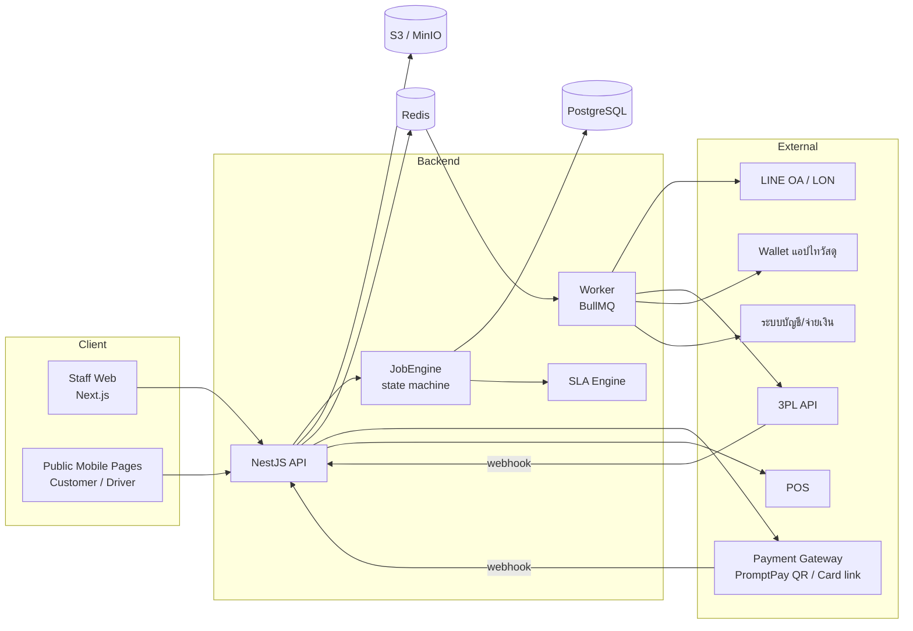

# 02 — สถาปัตยกรรมและ Tech Stack

## 1. Stack ที่เลือก

| ชั้น | เทคโนโลยี | เหตุผล |
|------|-----------|--------|
| Language | **TypeScript** ทั้ง frontend/backend | แชร์ type/enum/zod schema, AI agent เขียนได้แม่นยำ |
| Monorepo | **pnpm workspaces + Turborepo** | แยก app/package ชัด, cache build |
| Frontend | **Next.js 15 (App Router)** + React 19 + **Tailwind CSS** + **shadcn/ui** + TanStack Query + React Hook Form + zod | เร็ว, component พร้อม, form validation แชร์กับ API |
| Charts | **Recharts** | ใช้แทน Chart.js ใน prototype |
| Backend | **NestJS 11** (REST, modular) | โครงสร้างโมดูล/guard/DI ชัด เหมาะกับ RBAC และ state machine |
| ORM / DB | **Prisma 6 + PostgreSQL 16** | schema อ่านง่าย, migration, transaction |
| Queue / Scheduler | **BullMQ + Redis** | SLA timer, แจ้งเตือน, 3PL booking retry, สร้าง Excel ขนาดใหญ่ |
| File storage | **S3-compatible** (AWS S3 / MinIO ตอน dev) | ภาพถ่ายทุกขั้นตอน, PDF เอกสาร — ใช้ presigned upload |
| Auth | JWT (access 15 นาที + refresh 7 วัน, httpOnly cookie) + bcrypt | staff login; public page ใช้ signed token แยก |
| Excel | **exceljs** (server-side) | Export ทุกหน้า (prototype ใช้ SheetJS ฝั่ง client) |
| PDF / Print | HTML print template + **Playwright** render PDF (server) | ใบแจ้งซ่อม, ใบปะหน้า, ใบเสนอราคา, สติ๊กเกอร์ 2×2, exec report |
| QR | `qrcode` lib | QR บนใบแจ้งซ่อม/ใบปะหน้า/สติ๊กเกอร์ = URL `/scan/:jobNo` |
| Testing | Vitest (unit), Supertest (API), **Playwright** (E2E) | |
| Infra | Docker Compose (dev), container deploy (prod), GitHub Actions CI | |
| Observability | pino logger (JSON), OpenTelemetry-ready, Sentry | |

## 2. โครงสร้าง Monorepo

```
svcm/
├── apps/
│   ├── web/                      # Next.js — staff web + public pages
│   │   ├── app/(auth)/login
│   │   ├── app/(staff)/exec | analytics | jobs | cs | gr | dc | vd | tradein | s2 | reports | admin
│   │   ├── app/(public)/t/[token] | q/[token] | pay/[token] | d/[token] | s/[token]
│   │   ├── components/ui         # shadcn
│   │   ├── components/domain     # JobStatusBadge, SlaTag, PhotoCapture, LocationInput, QueueTabs, KpiCard ...
│   │   └── lib/api               # typed client (generated from shared zod)
│   ├── api/                      # NestJS
│   │   ├── src/modules/
│   │   │   ├── auth/  users/  rbac/
│   │   │   ├── master/           # branch, vendor, vendor-center, route, brand, size, fee, sla, sku, payout-config, promotion, dashboard-config
│   │   │   ├── customers/
│   │   │   ├── jobs/             # job CRUD + JobEngine (state machine) + queries by queue
│   │   │   ├── shipments/        # dispatch, driver link, 3PL booking
│   │   │   ├── locations/
│   │   │   ├── attachments/      # presigned upload, photo records
│   │   │   ├── quotes/
│   │   │   ├── payments/
│   │   │   ├── tradeins/
│   │   │   ├── stock-jobs/       # S2
│   │   │   ├── sla/              # SlaClock engine + overdue scanner (cron)
│   │   │   ├── notifications/    # LON
│   │   │   ├── payouts/
│   │   │   ├── reports/          # dashboard, analytics, exec, exports
│   │   │   ├── documents/        # print/PDF templates
│   │   │   └── public/           # token-based endpoints
│   │   └── src/integrations/     # adapters (ดู §4)
│   └── worker/                   # BullMQ processors (อาจรวมใน api ช่วง MVP)
├── packages/
│   ├── shared/                   # enums, zod schemas, DTO types, pure functions: fees.ts, quote.ts, sla.ts, promo.ts, payout.ts, running-no.ts
│   ├── db/                       # prisma schema + seed
│   └── config/                   # eslint, tsconfig, tailwind preset (design tokens)
├── docs/                         # เอกสารชุดนี้ + prototypes/
└── docker-compose.yml            # postgres, redis, minio, mailhog(optional)
```

**กติกาสำคัญ:** logic คำนวณเงิน/SLA/โปร/เลือก VD ต้องอยู่ใน `packages/shared` เป็น **pure function** มี unit test ครบ และถูกเรียกจาก API เท่านั้น (frontend เรียกเพื่อ preview ได้ แต่ค่าที่บันทึกต้องคำนวณซ้ำฝั่ง server)

## 3. Component Diagram



## 4. Integration Adapters

ทุก integration เป็น interface + provider 2 แบบ: `mock` (dev/test, มีปุ่ม "จำลอง" ใน UI เหมือน prototype เฉพาะ env ≠ production) และ `real`. เลือกด้วย env `INTEGRATION_<NAME>_PROVIDER`

| Adapter | Methods | ใช้ตอน | หมายเหตุ |
|---------|---------|--------|----------|
| `NotificationProvider` (LON) | `sendJobOpened(job, trackingUrl)`, `sendQuote(job, quote, quoteUrl)`, `sendReadyForPickup(job, payUrl?)`, `sendCsatSurvey(job, url)` | เปิดงาน, ส่งใบเสนอราคา, พร้อมรับ, ปิดงาน | ส่งตามเบอร์โทร/LINE UID; log ใน `NotificationLog`; retry 3 ครั้ง |
| `PaymentProvider` | `createPromptPayQr(amount, ref)`, `createCardPaymentLink(amount, ref)`, `verifyWebhook(req)` | ค่าดำเนินการ (CS), ค่าซ่อม (ลูกค้า) | webhook `/webhooks/payment` idempotent ด้วย `providerRef` |
| `PosProvider` | `verifyReceipt(receiptNo, amount)` | CS เลือกชำระด้วยเลขใบเสร็จ POS | MVP: บันทึกเลข + ตรวจรูปแบบ, verify จริงภายหลัง |
| `ThirdPartyLogisticsProvider` | `book({from,to,parcelSize,ref})→{trackingNo,labelPdfUrl}`, `cancel(trackingNo)`, `verifyWebhook` | GR Pack (ช่อง 3PL), VD ส่งคืน (3PL) | webhook status: `PICKED_UP`, `DELIVERED`, `FAILED` |
| `WalletCouponProvider` | `issueCoupon({phone, percent, ref, expiry})→walletRef`, `getStatus(walletRef)` | ออก Trade-in | sync สถานะ used ด้วย cron รายชั่วโมง หรือ webhook |
| `AccountingProvider` | `submitPayoutBatch(batch)→ref` | ส่งไปทำจ่าย VD | MVP: export Excel + mark SENT |
| `AddressProvider` | `lookupZip(zip)`, `listProvinces()`, `listDistricts(p)`, `listSubdistricts(d)` | ฟอร์มที่อยู่ | seed ฐานข้อมูลที่อยู่ไทยลง DB (ตาราง `ThaiAddress`) |
| `StorageProvider` | `presignUpload(key, mime)`, `getSignedUrl(key)` | ภาพ/เอกสาร | ภาพจำกัด 10MB, resize ฝั่ง client เป็น ≤1600px |

## 5. หลักการออกแบบ Backend

1. **JobEngine เป็นทางเดียวที่เปลี่ยน stage** — endpoint `POST /jobs/:id/actions/:action` → validate สิทธิ์ + precondition (ภาพ/Location/ยอดเงิน) → เขียน `JobEvent` + update `Job.stage` + start/stop `SlaClock` + enqueue side effects ใน **transaction เดียว** (outbox pattern: `OutboxMessage` แล้ว worker ส่ง)
2. **Optimistic locking** — `Job.version` ส่งมากับทุก action ป้องกันสองคนกดพร้อมกัน (409 Conflict)
3. **Idempotency** — action ที่มาจากสแกน/ webhook รับ header `Idempotency-Key`
4. **Audit ครบ** — `JobEvent` เก็บ actor, role, stage ก่อน/หลัง, payload, attachments → ใช้แสดง timeline ใน Job detail
5. **เงินเป็นหน่วยสตางค์ (integer)** ใน DB (`amountSatang`), แสดงผลเป็นบาท
6. **เวลา** เก็บ UTC (`timestamptz`), แสดง Asia/Bangkok; วันที่ในรายงานใช้ปี พ.ศ. ได้ตาม locale
7. **Soft delete** master data (`archivedAt`) — ห้ามลบ vendor/branch ที่มี job อ้างอิง
8. **Queue query** — แต่ละคิวของ GR/DC/VD = query จาก `Job.stage` + `Shipment.status` + scope ของผู้ใช้ (ไม่มีตารางคิวแยก)

## 6. Design System (จาก prototype)

ใช้ token เดิมใน `packages/config/tailwind-preset`:

```ts
colors: {
  red: { DEFAULT:'#C8102E', dark:'#9C0C22', tint:'#FBE7E9' },
  bg:'#FAF7F2', surface:'#FFFFFF', 'surface-2':'#F3EEE6',
  border:'#E4DED2', 'border-strong':'#D2C9B8',
  text:'#2B2723', 'text-2':'#6B6459', 'text-mute':'#9A9384',
  green:{DEFAULT:'#1D9E75', tint:'#E1F5EE'}, amber:{DEFAULT:'#BA7517', tint:'#FAEEDA'},
  blue:{DEFAULT:'#185FA5', tint:'#E6F1FB'}, coral:{DEFAULT:'#D85A30', tint:'#FAECE7'},
  teal:{DEFAULT:'#0F6E56'}, navy:'#1B2430', gold:'#B7862E'   // navy/gold ใช้เฉพาะ Executive Dashboard
}
fontFamily: { sans: ['Sarabun', 'sans-serif'] }
radius: card 12px, input 6px, badge full
```

Component กลางที่ต้องมี (ซ้ำทุกหน้าจอใน prototype):
`OverdueSummaryBanner`, `KpiCard(clickable → filter/tab)`, `QueueTabs(count)`, `SortableTable`, `SlaTag(hours, sla)`, `JobIdCell(overdue red)`, `PhotoCaptureButton(required)`, `LocationInput`, `StatusBadge`, `DateRangeExport`, `PrintPreviewModal`, `RadioCards`, `AddressFields(zip lookup)`, `MultiSelectTags`, `Toggle`

## 7. Non-functional Requirements

| หมวด | ข้อกำหนด |
|------|----------|
| ภาษา | UI ภาษาไทยทั้งหมด (i18n-ready ด้วย `next-intl`, key ภาษาอังกฤษ) |
| อุปกรณ์ | Staff: desktop + tablet (GR/DC/VD ใช้ tablet ถ่ายภาพ/สแกน); Public: mobile-first ≥360px |
| กล้อง/สแกน | ใช้ `<input capture>` + web barcode (`@zxing/browser`) สแกน QR เลขงาน |
| Performance | คิว/รายการ ≤ 1 วินาทีที่ 50k jobs (index บน stage, branchId, vendorCenterId, openedAt) ; dashboard ใช้ materialized view/รายวัน |
| Availability | 99.5% เวลาทำการ |
| Security | OWASP ASVS L2, RBAC + data scope ทุก query, public token = random 32 bytes + หมดอายุ (quote 7 วัน, driver 48 ชม.), rate limit public endpoints, PDPA: mask เบอร์โทรในคิวของ VD/DC (แสดง 4 ตัวท้าย) |
| Backup | PostgreSQL PITR, S3 versioning |
| Audit | ทุก action ใน `JobEvent`, ทุกการแก้ master data ใน `AuditLog` |
