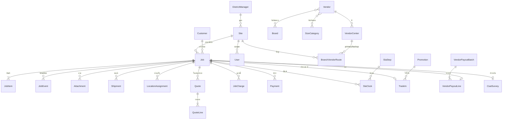

# 03 — Data Model

## 1. ER Overview



## 2. Entity Dictionary

### 2.1 Master data (Admin)

| Entity | ฟิลด์หลัก | มาจากหน้าจอ |
|--------|-----------|-------------|
| `Site` | code, name, type `BRANCH/DC`, address, districtManagerId (null ถ้า DC) | admin › สาขาไทวัสดุ |
| `DistrictManager` | name, areaLabel (เช่น "เขตกรุงเทพตะวันออก") — *คนดูแลหลายสาขา ไม่ใช่พื้นที่ภูมิศาสตร์* | admin › สาขา |
| `Brand` | name | cs dropdown, admin vendor |
| `SizeCategory` | code, name (สินค้าขนาดเล็ก/ใหญ่ — เพิ่มได้) | admin › ค่าดำเนินการ |
| `FeeRate` | sizeCategoryId, operationFee, shippingFee3pl, effectiveFrom | admin › ค่าดำเนินการ/ค่าขนส่ง |
| `Vendor` (VD หลัก) | code `VD-0088`, name, defaultGpPct, defaultRepairSlaDays, inspectionFeeCovered, inspectionFeeNotCovered, repairWarrantyDays, isBrandAuthorized, brands[], sizes[] | admin › Vendor Portal; vd.html `vdRegistration` |
| `VendorCenter` (ศูนย์ย่อย) | code `VD-0088-1`, vendorId, zoneSiteId, address, phone, method `DSD/DC/DC_DSD`, gpPctOverride?, repairSlaDaysOverride? | admin › Vendor Portal |
| `BranchVendorRoute` | branchId, primaryCenterId, backupCenterId?, standardChannel `DSD/DC` | admin › จับคู่สาขา-VD |
| `SlaStep` | code, seq, name, startEvent, stopEvent, hours, ownerDept, pausable, active | admin › SLA |
| `RepairSku` | code `SVC-REPAIR-001`, description, chargeType | admin › SKU ค่าซ่อม |
| `PayoutCycleConfig` | cycleType, daysOfMonth[], nextCycleDate | admin › รอบจ่ายเงิน |
| `Promotion` | name, tradeInType, sizeCategoryId, subDept?, percent, startDate, endDate, status, createdAt | admin › Trade-in/คูปอง |
| `RoleMenuPermission` | role, menuKey, allowed | admin › สิทธิ์ผู้ใช้งาน |
| `RoleDataPermission` | role, canViewCost | admin › Dashboard |
| `DashboardWidgetConfig` | widgetKey, enabled, sortOrder | admin › Dashboard |
| `SystemSetting` | key/value (vatRate, charge3plReturnFee, quoteExpiryDays, ...) | — |
| `ThaiAddress` | zipcode, province, district, subdistrict | cs ที่อยู่ |

### 2.2 Transaction

| Entity | คำอธิบาย |
|--------|----------|
| `User` | บัญชีพนักงาน/VD, role, scope (siteId หรือ vendorCenterId) |
| `Customer` | ชื่อ, เบอร์ (unique-ish ใช้ค้นหา), ที่อยู่, lineUserId? |
| `TaxInvoiceProfile` | ชื่อ/บริษัท, taxId 13 หลัก, ที่อยู่ — ผูกกับ Job (ใช้เมื่อไม่ใช่ที่อยู่ลูกค้า) |
| `Job` | ใบงานหลัก (ทั้ง CUSTOMER และ STOCK) |
| `JobItem` | สินค้าในใบงาน (CUSTOMER = 1 แถว, STOCK = หลายแถว มี qty, holdStockNo) |
| `JobEvent` | log ทุก action/transition — แหล่งข้อมูล timeline และ KPI |
| `Attachment` | ภาพ/เอกสาร ผูก job + event + kind |
| `LocationAssignment` | Location ของ job ที่ site ใด (assign/clear) |
| `Shipment` | ขาขนส่งแต่ละช่วง + dispatch (print/link/API) + tracking |
| `Quote` / `QuoteLine` | ใบเสนอราคา (มี version — แก้ไขได้ก่อนลูกค้าตัดสินใจ) |
| `JobCharge` | รายการเรียกเก็บ (+) / ส่วนลด (−) → ยอดค้าง = Σcharge − Σpaid |
| `Payment` | การชำระเงินแต่ละครั้ง |
| `SlaClock` | ตัวจับเวลา SLA ต่อ job ต่อ step |
| `TradeIn` | คูปองส่วนลด |
| `VendorDeduction` | หักเงิน VD กรณีผิดพลาด |
| `VendorPayoutBatch` / `VendorPayoutLine` | รอบจ่าย VD |
| `CsatSurvey` | คะแนน 1–5 + comment |
| `PublicToken` | token สำหรับลิงก์ลูกค้า/คนรถ |
| `NotificationLog`, `OutboxMessage`, `AuditLog`, `RunningNumber` | infra |

## 3. Prisma Schema (`packages/db/prisma/schema.prisma`)

```prisma
generator client {
  provider = "prisma-client-js"
}
datasource db {
  provider = "postgresql"
  url      = env("DATABASE_URL")
}

// ───────────── Enums ─────────────
enum Role {
  ADMIN
  EXECUTIVE
  CS
  GR
  DC
  VD
  S2
}
enum SiteType {
  BRANCH
  DC
}
enum JobType {
  CUSTOMER
  STOCK
}
enum ShippingMethod {
  STANDARD
  EXPRESS
}
enum Channel {  // TPL = 3PL
  DSD
  DC
  TPL
}
enum VendorCenterMethod {
  DSD
  DC
  DC_DSD
}
enum OwnerDept {  // CARRIER = resolve ตาม channel ตอน runtime
  CS
  GR
  DC
  VD
  TPL
  CUSTOMER
  CARRIER
}

enum JobStage {
  PENDING_VENDOR_ASSIGNMENT  // หา VD อัตโนมัติไม่ได้ รอ Admin กำหนด
  CS_OPENED  // รอส่งมอบ GR
  GR_RECEIVED  // GR รับแล้ว รอ Pack
  GR_PACKED  // รอขนส่งเข้ารับ / GR ส่งมอบ
  OUTBOUND_TO_DC  // ระหว่างขนส่งไป DC
  AT_DC_OUTBOUND  // อยู่ DC รอ VD มารับ
  OUTBOUND_TO_VD  // ระหว่างขนส่งไป VD
  VD_INSPECTING  // VD ตรวจสอบ/เสนอราคา
  WAITING_APPROVAL  // รอลูกค้าอนุมัติ
  REPAIRING  // กำลังซ่อม
  RETURN_PACKING  // รอ Pack ส่งคืน
  INBOUND_TO_DC  // ระหว่างส่งคืนไป DC
  AT_DC_INBOUND  // อยู่ DC รอส่งคืนสาขา
  INBOUND_TO_BRANCH  // ระหว่างขนส่งคืนสาขา
  GR_RETURN_RECEIVED  // GR รับคืนแล้ว รอส่งมอบ CS
  READY_FOR_PICKUP  // พร้อมรับที่สาขา
  CLOSED_REPAIRED
  CLOSED_NOT_REPAIRED
  CANCELLED
}

enum CustomerDecision {
  APPROVED
  REJECTED
  AUTO_APPROVED
}
enum ShipmentDirection {
  OUTBOUND
  INBOUND
}
enum ShipmentLeg {
  BRANCH_TO_DC
  DC_TO_VD
  BRANCH_TO_VD
  VD_TO_DC
  DC_TO_BRANCH
  VD_TO_BRANCH
}
enum Carrier {
  DC_FLEET
  VD_FLEET
  TPL
}
enum ShipmentStatus {
  PENDING_DISPATCH
  DISPATCHED
  PICKED_UP
  DELIVERED
  FAILED
  CANCELLED
}
enum DispatchMethod {
  PRINT
  LINK
  API
}

enum AttachmentKind {
  INTAKE_PRODUCT
  GR_RECEIVE
  GR_PACK
  GR_HANDOFF
  CARRIER_PICKUP
  DC_HANDOFF_VD
  VD_RETURN_PACK
  DC_RETURN_RECEIVE
  GR_RETURN_RECEIVE
  GR_DELIVER_CS
  TRADEIN_PRODUCT
  DOCUMENT_PDF
  OTHER
}

enum QuoteStatus {
  DRAFT
  SENT
  APPROVED
  REJECTED
  EXPIRED
  SUPERSEDED
}
enum QuoteLineType {
  INSPECTION_FEE
  PART
  LABOR
  OTHER
}
enum ChargeType {
  OPERATION_FEE
  SHIPPING_FEE
  REPAIR
  OPERATION_FEE_CREDIT
  ADJUSTMENT
}
enum PaymentPurpose {
  INTAKE
  REPAIR
}
enum PaymentMethod {
  PROMPTPAY_QR
  CARD_LINK
  POS_RECEIPT
}
enum PaymentStatus {
  PENDING
  PAID
  FAILED
  EXPIRED
  REFUNDED
}

enum SlaClockStatus {
  RUNNING
  PAUSED
  STOPPED
}
enum TradeInType {
  TYPE1_WALK_IN
  TYPE2_BACKOFFICE
}
enum TradeInStatus {
  ISSUED
  USED
  EXPIRED
  FAILED
}
enum PromotionStatus {
  DRAFT
  ACTIVE
  INACTIVE
}
enum PayoutCycleType {
  DAYS_OF_MONTH
  EVERY_15_DAYS
  WEEKLY
}
enum PayoutBatchStatus {
  DRAFT
  SENT
  PAID
}
enum TokenPurpose {
  TRACKING
  QUOTE
  PAYMENT
  DRIVER
  CSAT
}

// ───────────── Master ─────────────
model DistrictManager {
  id        String @id @default(cuid())
  name      String
  areaLabel String
  sites     Site[]
}

model Site {
  id                String   @id @default(cuid())
  code              String   @unique
  name              String
  type              SiteType
  address           String?
  districtManagerId String?
  districtManager   DistrictManager? @relation(fields: [districtManagerId], references: [id])
  archivedAt        DateTime?
  users             User[]
  jobsOpened        Job[]    @relation("JobBranch")
  routes            BranchVendorRoute[]
  vendorCentersZone VendorCenter[]
}

model Brand {
  id      String   @id @default(cuid())
  name    String   @unique
  vendors Vendor[]
}

model SizeCategory {
  id         String      @id @default(cuid())
  code       String      @unique   // SMALL, LARGE
  name       String                 // สินค้าขนาดเล็ก
  feeRates   FeeRate[]
  vendors    Vendor[]
  promotions Promotion[]
}

model FeeRate {
  id                   String   @id @default(cuid())
  sizeCategoryId       String
  sizeCategory         SizeCategory @relation(fields: [sizeCategoryId], references: [id])
  operationFeeSatang   Int
  shippingFee3plSatang Int
  effectiveFrom        DateTime @default(now())
  @@index([sizeCategoryId, effectiveFrom])
}

model Vendor {
  id                          String   @id @default(cuid())
  code                        String   @unique       // VD-0088
  name                        String
  defaultGpPct                Decimal  @db.Decimal(5,2)
  defaultRepairSlaDays        Int
  inspectionFeeCoveredSatang  Int      @default(0)
  inspectionFeeNotCoveredSatang Int    @default(0)
  repairWarrantyDays          Int      @default(30)
  isBrandAuthorized           Boolean  @default(true)
  brands                      Brand[]
  sizes                       SizeCategory[]
  centers                     VendorCenter[]
  deductions                  VendorDeduction[]
  archivedAt                  DateTime?
}

model VendorCenter {
  id                     String   @id @default(cuid())
  code                   String   @unique      // VD-0088-1
  vendorId               String
  vendor                 Vendor   @relation(fields: [vendorId], references: [id])
  zoneSiteId             String?
  zoneSite               Site?    @relation(fields: [zoneSiteId], references: [id])
  address                String?
  phone                  String?
  method                 VendorCenterMethod
  gpPctOverride          Decimal? @db.Decimal(5,2)
  repairSlaDaysOverride  Int?
  users                  User[]
  jobs                   Job[]
  primaryRoutes          BranchVendorRoute[] @relation("PrimaryCenter")
  backupRoutes           BranchVendorRoute[] @relation("BackupCenter")
  archivedAt             DateTime?
}

model BranchVendorRoute {
  id              String  @id @default(cuid())
  branchId        String
  branch          Site    @relation(fields: [branchId], references: [id])
  primaryCenterId String
  primaryCenter   VendorCenter  @relation("PrimaryCenter", fields: [primaryCenterId], references: [id])
  backupCenterId  String?
  backupCenter    VendorCenter? @relation("BackupCenter", fields: [backupCenterId], references: [id])
  standardChannel Channel       // DSD | DC (ห้าม TPL)
  @@unique([branchId, primaryCenterId])
}

model SlaStep {
  id          String    @id @default(cuid())
  code        String    @unique        // ดู 05 §4
  seq         Int
  name        String
  startEvent  String                   // JobEventType
  stopEvent   String                   // JobEventType (คั่นด้วย | ได้หลายค่า)
  condition   String?                  // เช่น "channel=DC" / "channel!=DC" / "type=CUSTOMER"
  hours       Int
  ownerDept   OwnerDept
  pausable    Boolean   @default(false)
  appliesTo   JobType[] @default([CUSTOMER, STOCK])
  active      Boolean   @default(true)
  clocks      SlaClock[]
}

model RepairSku {
  id          String     @id @default(cuid())
  code        String     @unique
  description String
  chargeType  ChargeType
}

model PayoutCycleConfig {
  id            String          @id @default(cuid())
  cycleType     PayoutCycleType
  daysOfMonth   Int[]
  nextCycleDate DateTime
}

model Promotion {
  id             String          @id @default(cuid())
  name           String
  tradeInType    TradeInType
  sizeCategoryId String
  sizeCategory   SizeCategory    @relation(fields: [sizeCategoryId], references: [id])
  subDept        String?
  percent        Decimal         @db.Decimal(5,2)
  startDate      DateTime        @db.Date
  endDate        DateTime        @db.Date
  status         PromotionStatus @default(DRAFT)
  createdAt      DateTime        @default(now())
  tradeIns       TradeIn[]
}

model RoleMenuPermission {
  role    Role
  menuKey String
  allowed Boolean
  @@id([role, menuKey])
}

model RoleDataPermission {
  role        Role    @id
  canViewCost Boolean @default(false)
}

model DashboardWidgetConfig {
  widgetKey String  @id
  enabled   Boolean @default(true)
  sortOrder Int
}

model SystemSetting {
  key   String @id
  value Json
}

model ThaiAddress {
  id          Int    @id @default(autoincrement())
  zipcode     String
  province    String
  district    String
  subdistrict String
  @@index([zipcode])
  @@index([province, district])
}

// ───────────── Users ─────────────
model User {
  id             String        @id @default(cuid())
  username       String        @unique
  passwordHash   String
  displayName    String
  role           Role
  siteId         String?       // CS/GR/S2 = สาขา, DC = คลัง
  site           Site?         @relation(fields: [siteId], references: [id])
  vendorCenterId String?       // VD
  vendorCenter   VendorCenter? @relation(fields: [vendorCenterId], references: [id])
  active         Boolean       @default(true)
  createdAt      DateTime      @default(now())
}

// ───────────── Job core ─────────────
model Customer {
  id          String  @id @default(cuid())
  name        String
  phone       String
  zipcode     String?
  province    String?
  district    String?
  subdistrict String?
  street      String?
  lineUserId  String?
  jobs        Job[]
  @@index([phone])
}

model TaxInvoiceProfile {
  id          String @id @default(cuid())
  name        String
  taxId       String
  zipcode     String
  province    String
  district    String
  subdistrict String
  street      String
  job         Job?
}

model Job {
  id                       String         @id @default(cuid())
  jobNo                    String         @unique      // JB-2609-08231 / STK-2609-01032
  type                     JobType
  stage                    JobStage
  stageEnteredAt           DateTime       @default(now())
  version                  Int            @default(0)
  branchId                 String
  branch                   Site           @relation("JobBranch", fields: [branchId], references: [id])
  customerId               String?
  customer                 Customer?      @relation(fields: [customerId], references: [id])
  taxInvoiceProfileId      String?        @unique
  taxInvoiceProfile        TaxInvoiceProfile? @relation(fields: [taxInvoiceProfileId], references: [id])
  useCustomerAddressForTax Boolean        @default(true)

  // intake (CUSTOMER)
  hasWarranty              Boolean?
  allowNonAuthorizedVendor Boolean        @default(false)
  sizeCategoryId           String?
  shippingMethod           ShippingMethod?
  defectNotes              String?        // ระบุตำหนิ

  // routing
  vendorCenterId           String?
  vendorCenter             VendorCenter?  @relation(fields: [vendorCenterId], references: [id])
  channel                  Channel?
  vdContactName            String?        // STOCK: ผู้รับเรื่องฝั่ง VD

  // outcome
  customerDecision         CustomerDecision?
  decidedAt                DateTime?
  repairFinishedAt         DateTime?
  closedAt                 DateTime?
  cancelledReason          String?

  openedById               String
  openedAt                 DateTime       @default(now())
  items                    JobItem[]
  events                   JobEvent[]
  attachments              Attachment[]
  shipments                Shipment[]
  locations                LocationAssignment[]
  quotes                   Quote[]
  charges                  JobCharge[]
  payments                 Payment[]
  slaClocks                SlaClock[]
  tradeIn                  TradeIn?
  payoutLine               VendorPayoutLine?
  csat                     CsatSurvey?
  tokens                   PublicToken[]

  @@index([stage])
  @@index([branchId, stage])
  @@index([vendorCenterId, stage])
  @@index([openedAt])
}

model JobItem {
  id          String  @id @default(cuid())
  jobId       String
  job         Job     @relation(fields: [jobId], references: [id])
  sku         String?
  productName String
  brandId     String?
  qty         Int     @default(1)
  holdStockNo String?     // STOCK
  defect      String      // อาการเสีย
}

model JobEvent {
  id          String    @id @default(cuid())
  jobId       String
  job         Job       @relation(fields: [jobId], references: [id])
  type        String    // JobEventType ดู 04 §3
  fromStage   JobStage?
  toStage     JobStage?
  actorUserId String?   // null = system / customer / webhook
  actorRole   String    // ADMIN | CS | ... | CUSTOMER | SYSTEM | TPL_WEBHOOK | DRIVER
  payload     Json?
  createdAt   DateTime  @default(now())
  attachments Attachment[]
  @@index([jobId, createdAt])
  @@index([type, createdAt])
}

model Attachment {
  id         String         @id @default(cuid())
  jobId      String?
  job        Job?           @relation(fields: [jobId], references: [id])
  eventId    String?
  event      JobEvent?      @relation(fields: [eventId], references: [id])
  tradeInId  String?
  tradeIn    TradeIn?       @relation(fields: [tradeInId], references: [id])
  kind       AttachmentKind
  storageKey String
  mimeType   String
  uploadedBy String?
  createdAt  DateTime       @default(now())
}

model LocationAssignment {
  id           String    @id @default(cuid())
  jobId        String
  job          Job       @relation(fields: [jobId], references: [id])
  siteId       String
  locationCode String    // A-05-02
  purpose      String    // GR_RECEIVE | GR_PACK | DC_OUTBOUND | GR_RETURN
  assignedAt   DateTime  @default(now())
  clearedAt    DateTime?
  @@index([siteId, clearedAt])
}

model Shipment {
  id              String         @id @default(cuid())
  jobId           String
  job             Job            @relation(fields: [jobId], references: [id])
  direction       ShipmentDirection
  leg             ShipmentLeg
  carrier         Carrier
  status          ShipmentStatus @default(PENDING_DISPATCH)
  dispatchMethod  DispatchMethod?
  dispatchedAt    DateTime?
  pickedUpAt      DateTime?
  deliveredAt     DateTime?
  trackingNo      String?        // 3PL
  labelStorageKey String?
  costSatang      Int?           // ต้นทุนขนส่ง (analytics)
  createdAt       DateTime       @default(now())
  @@index([status, leg])
}

model Quote {
  id                 String      @id @default(cuid())
  quoteNo            String      @unique     // QT-2609-03001
  jobId              String
  job                Job         @relation(fields: [jobId], references: [id])
  version            Int         @default(1)
  status             QuoteStatus @default(DRAFT)
  subtotalSatang     Int
  vatSatang          Int
  totalSatang        Int
  vatRate            Decimal     @db.Decimal(5,4)
  repairDays         Int?
  repairWarrantyDays Int
  vendorNote         String?
  createdById        String
  sentAt             DateTime?
  expiresAt          DateTime?
  decidedAt          DateTime?
  lines              QuoteLine[]
  createdAt          DateTime    @default(now())
}

model QuoteLine {
  id               String        @id @default(cuid())
  quoteId          String
  quote            Quote         @relation(fields: [quoteId], references: [id])
  type             QuoteLineType
  description      String
  priceSatang      Int           // ก่อน VAT
  partWaitDays     Int?
  partWarrantyDays Int?
  sortOrder        Int
}

model JobCharge {
  id           String     @id @default(cuid())
  jobId        String
  job          Job        @relation(fields: [jobId], references: [id])
  type         ChargeType
  amountSatang Int        // ส่วนลดเป็นค่าลบ
  repairSkuId  String?
  quoteId      String?
  note         String?
  createdAt    DateTime   @default(now())
}

model Payment {
  id           String         @id @default(cuid())
  jobId        String
  job          Job            @relation(fields: [jobId], references: [id])
  purpose      PaymentPurpose
  method       PaymentMethod
  amountSatang Int
  status       PaymentStatus  @default(PENDING)
  providerRef  String?        @unique
  posReceiptNo String?
  qrPayload    String?
  paymentUrl   String?
  paidAt       DateTime?
  createdAt    DateTime       @default(now())
}

model SlaClock {
  id            String         @id @default(cuid())
  jobId         String
  job           Job            @relation(fields: [jobId], references: [id])
  slaStepId     String
  slaStep       SlaStep        @relation(fields: [slaStepId], references: [id])
  ownerDept     OwnerDept      // resolve แล้ว (ไม่มี CARRIER)
  status        SlaClockStatus @default(RUNNING)
  startedAt     DateTime
  dueAt         DateTime
  pausedAt      DateTime?
  pausedMinutes Int            @default(0)
  stoppedAt     DateTime?
  breached      Boolean        @default(false)
  breachedAt    DateTime?
  @@unique([jobId, slaStepId])
  @@index([status, dueAt])
}

// ───────────── Trade-in / Finance ─────────────
model TradeIn {
  id             String        @id @default(cuid())
  tradeInNo      String        @unique   // TI-2609-04181
  type           TradeInType
  jobId          String?       @unique
  job            Job?          @relation(fields: [jobId], references: [id])
  customerName   String
  customerPhone  String
  sku            String?
  productName    String
  brandName      String?
  defect         String?
  sizeCategoryId String
  promotionId    String?
  promotion      Promotion?    @relation(fields: [promotionId], references: [id])
  percent        Decimal       @db.Decimal(5,2)
  status         TradeInStatus @default(ISSUED)
  walletRef      String?
  usedAt         DateTime?
  createdById    String
  createdAt      DateTime      @default(now())
  attachments    Attachment[]
}

model VendorDeduction {
  id           String   @id @default(cuid())
  vendorId     String
  vendor       Vendor   @relation(fields: [vendorId], references: [id])
  jobId        String?
  amountSatang Int
  reason       String
  payoutLineId String?
  createdAt    DateTime @default(now())
}

model VendorPayoutBatch {
  id          String            @id @default(cuid())
  cycleDate   DateTime          @db.Date
  status      PayoutBatchStatus @default(DRAFT)
  sentAt      DateTime?
  sentById    String?
  externalRef String?
  lines       VendorPayoutLine[]
}

model VendorPayoutLine {
  id                 String            @id @default(cuid())
  batchId            String
  batch              VendorPayoutBatch @relation(fields: [batchId], references: [id])
  jobId              String            @unique
  job                Job               @relation(fields: [jobId], references: [id])
  vendorCenterId     String
  branchId           String
  repairAmountSatang Int               // ฐานคำนวณ ดู 05 §7
  gpPct              Decimal           @db.Decimal(5,2)
  gpAmountSatang     Int
  deductionSatang    Int               @default(0)
  netAmountSatang    Int
  selected           Boolean           @default(false)
}

model CsatSurvey {
  id          String   @id @default(cuid())
  jobId       String   @unique
  job         Job      @relation(fields: [jobId], references: [id])
  score       Int      // 1..5
  comment     String?
  submittedAt DateTime @default(now())
}

// ───────────── Infra ─────────────
model PublicToken {
  token     String       @id            // random 32 bytes base64url
  purpose   TokenPurpose
  jobId     String
  job       Job          @relation(fields: [jobId], references: [id])
  refId     String?      // quoteId / shipmentId / paymentId
  expiresAt DateTime
  usedAt    DateTime?
}

model RunningNumber {
  prefix  String   // JB | STK | TI | QT
  yymm    String
  lastSeq Int
  @@id([prefix, yymm])
}

model NotificationLog {
  id        String   @id @default(cuid())
  jobId     String?
  channel   String   // LON
  template  String
  recipient String
  status    String
  error     String?
  createdAt DateTime @default(now())
}

model OutboxMessage {
  id          String    @id @default(cuid())
  topic       String
  payload     Json
  processedAt DateTime?
  attempts    Int       @default(0)
  createdAt   DateTime  @default(now())
}

model AuditLog {
  id        String   @id @default(cuid())
  userId    String
  entity    String
  entityId  String
  action    String
  before    Json?
  after     Json?
  createdAt DateTime @default(now())
}
```

## 4. Seed data (ตรงกับ prototype เพื่อ demo)

- Sites: สาขาบางนา, สาขารังสิต, สาขาแจ้งวัฒนะ, สาขาพระราม 2, สาขาเชียงใหม่ (BRANCH) ; คลัง DC กรุงเทพ, คลัง DC ชลบุรี (DC)
- DistrictManager: คุณวิชัย (กทม.ตะวันออก → บางนา, แจ้งวัฒนะ), คุณสมหญิง (ปทุมธานี → รังสิต), คุณอนุชา (กทม.ตะวันตก → พระราม 2), คุณปิยะ (ภาคเหนือ → เชียงใหม่)
- Brands: Bosch, Makita, Xiaomi, Philips, Panasonic
- SizeCategory + FeeRate: SMALL (ค่าดำเนินการ 150, 3PL 80), LARGE (300, 250)
- Vendors: VD-0088 บ.ช่างเจริญ (GP 18%, SLA 7 วัน, Bosch/Makita, ใหญ่, ค่าเปิดเครื่อง ไม่มีประกัน 300 / มีประกัน 0, รับประกันงานซ่อม 30 วัน) + center VD-0088-1 (บางนา, DC_DSD); VD-0091 ศูนย์ซ่อมไฟฟ้ารุ่งเรือง (GP 15%, SLA 5 วัน, Xiaomi/Philips, เล็ก) + VD-0091-1 (รังสิต, DSD); VD-0102 ช่างเทค เซอร์วิส (20%); VD-0075 บ.อีเลคโทรฟิกซ์ (16%)
- BranchVendorRoute: บางนา → primary VD-0088-1, backup VD-0091-1, standardChannel DC
- SlaStep: 16 ขั้นตาม 05 §4
- RepairSku: SVC-REPAIR-001 ค่าซ่อมสินค้า, SVC-OPENFEE-001 ค่าเปิดเครื่องตรวจเช็ค, SVC-OPFEE-001 ค่าดำเนินการ, SVC-SHIP-001 ค่าขนส่ง 3PL
- Promotions: โปรทั่วไป (T1, SMALL, 10%, 2026-09-01..2026-12-31, ACTIVE), โปรทั่วไปใหญ่ (T1, LARGE, 8%), โปรปีใหม่ (T2, LARGE, 15%, 2026-08-15..2027-01-15, createdAt 2026-08-20), โปรลูกค้าเก่า (T2, LARGE, 15%, 2026-09-01..2026-10-31, createdAt 2026-09-05)
- Users: admin, cs.bangna, gr.bangna, dc.bkk, vd.0088, s2.bangna, exec (password dev: `Passw0rd!`)
- Jobs: สร้างจาก `jobsRaw` ใน `dashboard.html` ให้ครอบคลุมทุก stage
