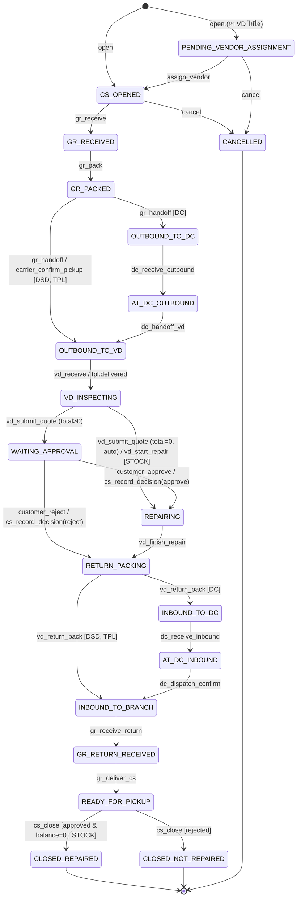

# 04 — Workflow & State Machine (Job Engine)

> หัวใจของระบบ: ทุกคิวในหน้า GR / DC / VD / CS คือ "มุมมอง" ของ `Job.stage` + `Shipment.status`
> การเปลี่ยน stage ทำได้ผ่าน `JobEngine.execute(jobId, action, input, actor)` เท่านั้น

## 1. Stage Catalog

| Stage | ป้ายภาษาไทย (UI) | Badge | ผู้รับผิดชอบหลัก | Pipeline group (analytics) |
|-------|------------------|-------|-----------------|----------------------------|
| `PENDING_VENDOR_ASSIGNMENT` | รอกำหนดศูนย์ซ่อม | amber | ADMIN | INTAKE |
| `CS_OPENED` | รอส่งมอบ GR | gray | CS | INTAKE |
| `GR_RECEIVED` | GR กำลัง Pack | gray | GR | INTAKE |
| `GR_PACKED` | รอขนส่งเข้ารับ | gray | GR / Carrier | INTAKE |
| `OUTBOUND_TO_DC` | ระหว่างขนส่งไป DC | blue | DC | INTAKE |
| `AT_DC_OUTBOUND` | อยู่ที่ DC รอ VD รับ | blue | DC / VD | INTAKE |
| `OUTBOUND_TO_VD` | ระหว่างขนส่งไป VD | blue | Carrier | INTAKE |
| `VD_INSPECTING` | VD ตรวจสอบ | blue | VD | INTAKE |
| `WAITING_APPROVAL` | รอลูกค้าอนุมัติ | amber | CUSTOMER | WAITING_APPROVAL |
| `REPAIRING` | กำลังซ่อม | blue | VD | REPAIR_IN_PROGRESS |
| `RETURN_PACKING` | รอ Pack ส่งคืน | blue | VD | QA_LOGISTICS |
| `INBOUND_TO_DC` | ระหว่างส่งคืน (ไป DC) | blue | VD / DC | QA_LOGISTICS |
| `AT_DC_INBOUND` | อยู่ที่ DC รอส่งสาขา | blue | DC | QA_LOGISTICS |
| `INBOUND_TO_BRANCH` | ระหว่างขนส่งคืน | blue | Carrier | QA_LOGISTICS |
| `GR_RETURN_RECEIVED` | รอส่งมอบ CS | amber | GR | QA_LOGISTICS |
| `READY_FOR_PICKUP` | พร้อมรับที่สาขา | amber | CS | READY_FOR_PICKUP |
| `CLOSED_REPAIRED` | ปิดงาน (ซ่อมสำเร็จ) | green | — | CLOSED |
| `CLOSED_NOT_REPAIRED` | ปิดงาน (ไม่ซ่อม) | coral | — | CLOSED |
| `CANCELLED` | ยกเลิก | gray | — | CLOSED |

## 2. State Diagram



## 3. Action Catalog (สัญญาของ JobEngine)

สัญลักษณ์: 📷 = ต้องแนบภาพ ≥1 (kind ในวงเล็บ), 📍 = ต้องกรอก Location, 💰 = เงื่อนไขการเงิน

| Action | Actor | From stage | Preconditions | To stage | Side effects | Event type |
|--------|-------|-----------|---------------|----------|--------------|------------|
| `open` | CS | — | ข้อมูลลูกค้า+สินค้าครบ, ภาพ intake 0–4 | `CS_OPENED` หรือ `PENDING_VENDOR_ASSIGNMENT` | gen `jobNo`; resolve VD+channel (05 §3); create `JobCharge` OPERATION_FEE / SHIPPING_FEE (05 §1); create intake `Payment` ถ้ายอด>0; token TRACKING; LON `sendJobOpened` | `JOB_OPENED` |
| `record_intake_payment` | CS / webhook | `CS_OPENED`, `PENDING_VENDOR_ASSIGNMENT` | method POS ต้องมี `posReceiptNo` | (คงเดิม) | Payment → PAID | `PAYMENT_RECEIVED` |
| `assign_vendor` | ADMIN | `PENDING_VENDOR_ASSIGNMENT` (เปลี่ยน stage) / `CS_OPENED`,`GR_RECEIVED` (reassign) | center ต้องรับแบรนด์+ขนาด หรือ override พร้อมเหตุผล | `CS_OPENED` / คงเดิม | set vendorCenterId, channel | `VENDOR_ASSIGNED` |
| `gr_receive` | GR | `CS_OPENED` | 📷(GR_RECEIVE) 📍; 💰 intake balance = 0 | `GR_RECEIVED` | LocationAssignment(GR_RECEIVE) | `GR_RECEIVED` |
| `gr_pack` | GR | `GR_RECEIVED` | 📷(GR_PACK) 📍 ใหม่ | `GR_PACKED` | clear location เดิม, assign ใหม่; create outbound Shipment (§4); ถ้า TPL → `3PL.book()` shipment=DISPATCHED(API); render ใบปะหน้า PDF | `GR_PACKED` |
| `dispatch_pickup` | DC (leg BRANCH_TO_DC, DC_TO_BRANCH) / VD (leg BRANCH_TO_VD[VD_FLEET], DC_TO_VD) | shipment `PENDING_DISPATCH` | method = PRINT หรือ LINK | (คงเดิม) | shipment → DISPATCHED; LINK → สร้าง token DRIVER + URL `/d/:token`; PRINT → PDF เอกสารคนรถ | `SHIPMENT_DISPATCHED` |
| `gr_handoff` | GR (scan QR / กดยืนยัน) | `GR_PACKED` | shipment outbound ≠ PENDING_DISPATCH; 📷(GR_HANDOFF) | `OUTBOUND_TO_DC` (DC) / `OUTBOUND_TO_VD` (DSD, TPL) | shipment → PICKED_UP; clear GR location | `OUTBOUND_HANDED_OFF` |
| `carrier_confirm_pickup` | VD / DRIVER token | `GR_PACKED` (DSD) | 📷(CARRIER_PICKUP) | เหมือน `gr_handoff` (ถ้ายังไม่มีใครยืนยัน) มิฉะนั้นแค่แนบภาพ | — | `CARRIER_PICKUP_CONFIRMED` |
| `dc_receive_outbound` | DC | `OUTBOUND_TO_DC` | 📍 | `AT_DC_OUTBOUND` | shipment BRANCH_TO_DC → DELIVERED; LocationAssignment(DC_OUTBOUND); create Shipment DC_TO_VD (VD_FLEET) | `DC_RECEIVED_OUTBOUND` |
| `dc_handoff_vd` | DC | `AT_DC_OUTBOUND` | shipment DC_TO_VD = DISPATCHED; 📷(DC_HANDOFF_VD) | `OUTBOUND_TO_VD` | shipment → PICKED_UP; **clear DC location** | `DC_HANDED_OFF_VD` |
| `vd_receive` | VD (scan / คีย์เลขงาน) | `OUTBOUND_TO_VD` | shipment ขาเข้า VD = PICKED_UP | `VD_INSPECTING` | shipment → DELIVERED | `VD_RECEIVED` |
| `tpl.delivered` (webhook) | TPL_WEBHOOK | `OUTBOUND_TO_VD` (leg BRANCH_TO_VD TPL) / `INBOUND_TO_BRANCH` (leg VD_TO_BRANCH TPL) | signature valid | `VD_INSPECTING` / (คงเดิม, แจ้ง GR) | shipment → DELIVERED | `VD_RECEIVED` / `TPL_DELIVERED_BRANCH` |
| `tpl.picked_up` (webhook) | TPL_WEBHOOK | `GR_PACKED` / `INBOUND_TO_BRANCH` | — | `OUTBOUND_TO_VD` ถ้า GR ยังไม่กด handoff / คงเดิม | shipment → PICKED_UP | `OUTBOUND_HANDED_OFF` / `TPL_PICKED_UP_RETURN` |
| `vd_submit_quote` | VD | `VD_INSPECTING` (CUSTOMER เท่านั้น) | ≥1 line; repairDays ≥1 | `WAITING_APPROVAL`; ถ้า total=0 → `REPAIRING` (decision AUTO_APPROVED) | create Quote SENT (05 §2) + token QUOTE (หมดอายุ `quoteExpiryDays`); LON `sendQuote`; PDF ใบเสนอราคา | `QUOTE_SENT` (+`CUSTOMER_APPROVED` ถ้า auto) |
| `vd_revise_quote` | VD | `WAITING_APPROVAL` | — | (คงเดิม) | quote เดิม SUPERSEDED, ใหม่ SENT version+1, token ใหม่, แจ้งลูกค้าอีกครั้ง; **restart** SLA CUSTOMER_APPROVAL | `QUOTE_REVISED` |
| `customer_approve` | CUSTOMER (token QUOTE) | `WAITING_APPROVAL` | quote SENT & ไม่หมดอายุ | `REPAIRING` | quote APPROVED; decision APPROVED; JobCharge REPAIR (+quote.total), OPERATION_FEE_CREDIT (−ค่าดำเนินการที่ชำระแล้ว, 05 §1.3); ถ้าลูกค้าเลือกจ่ายทันที → create Payment(REPAIR) | `CUSTOMER_APPROVED` |
| `customer_reject` | CUSTOMER (token QUOTE) | `WAITING_APPROVAL` | quote SENT | `RETURN_PACKING` | quote REJECTED; decision REJECTED; create inbound shipment (§4) | `CUSTOMER_REJECTED` |
| `cs_record_decision` | CS / ADMIN | `WAITING_APPROVAL` | reason (เช่น "ลูกค้าแจ้งทางโทรศัพท์") | เหมือน approve/reject | เหมือนกัน + actor = staff | `CUSTOMER_APPROVED` / `CUSTOMER_REJECTED` |
| `vd_start_repair` | VD | `VD_INSPECTING` (STOCK เท่านั้น) | — | `REPAIRING` | — | `REPAIR_STARTED` |
| `vd_pause_parts` / `vd_resume_parts` | VD | `REPAIRING` | reason | (คงเดิม) | pause/resume SlaClock VD_REPAIR | `REPAIR_PAUSED` / `REPAIR_RESUMED` |
| `vd_finish_repair` | VD | `REPAIRING` | — | `RETURN_PACKING` | repairFinishedAt; create inbound Shipment (§4) | `REPAIR_FINISHED` |
| `vd_return_pack` | VD | `RETURN_PACKING` | DC/DSD: 📷(VD_RETURN_PACK); TPL: ไม่บังคับภาพ | DC → `INBOUND_TO_DC`; DSD → `INBOUND_TO_BRANCH`; TPL → `INBOUND_TO_BRANCH` | DC/DSD: shipment → PICKED_UP + ใบปะหน้าขาคืน; TPL: `3PL.book()` shipment → DISPATCHED(API) + label | `RETURN_PACKED` |
| `dc_receive_inbound` | DC | `INBOUND_TO_DC` | 📷(DC_RETURN_RECEIVE) | `AT_DC_INBOUND` | shipment VD_TO_DC → DELIVERED; create Shipment DC_TO_BRANCH (DC_FLEET) | `DC_RECEIVED_INBOUND` |
| `dc_dispatch_confirm` | DC | `AT_DC_INBOUND` | shipment DC_TO_BRANCH = DISPATCHED | `INBOUND_TO_BRANCH` | shipment → PICKED_UP | `DC_DISPATCHED_TO_BRANCH` |
| `gr_receive_return` | GR | `INBOUND_TO_BRANCH` | 📷(GR_RETURN_RECEIVE) 📍 | `GR_RETURN_RECEIVED` | shipment ขาเข้าสาขา → DELIVERED; LocationAssignment(GR_RETURN) | `GR_RETURN_RECEIVED` |
| `gr_deliver_cs` | GR | `GR_RETURN_RECEIVED` | 📷(GR_DELIVER_CS) | `READY_FOR_PICKUP` | clear location; CUSTOMER: LON `sendReadyForPickup` (+ลิงก์ชำระถ้ายอดค้าง > 0) | `DELIVERED_TO_CS` |
| `record_repair_payment` | CS / CUSTOMER / webhook | `REPAIRING`…`READY_FOR_PICKUP` | amount ≤ balance | (คงเดิม) | Payment PAID | `PAYMENT_RECEIVED` |
| `cs_close` | CS (CUSTOMER), S2/GR (STOCK) | `READY_FOR_PICKUP` | 💰 CUSTOMER+APPROVED: balance = 0; REJECTED: ไม่มีเงื่อนไข | APPROVED/AUTO/STOCK → `CLOSED_REPAIRED`; REJECTED → `CLOSED_NOT_REPAIRED` | closedAt; stop clocks; CUSTOMER: token CSAT + LON; CLOSED_REPAIRED+CUSTOMER → eligible payout | `JOB_CLOSED` |
| `cancel` | ADMIN (ทุก stage ก่อนปิด), CS (เฉพาะ `CS_OPENED`, `PENDING_VENDOR_ASSIGNMENT`) | ≤ `CS_OPENED` สำหรับ CS | reason | `CANCELLED` | cancel shipments/3PL; stop clocks; refund = manual (flag) | `JOB_CANCELLED` |

**Event อื่นที่ไม่เปลี่ยน stage:** `PHOTO_ADDED`, `NOTE_ADDED`, `QUOTE_VIEWED` (ลูกค้าเปิดลิงก์), `QUOTE_EXPIRED`, `NOTIFICATION_SENT`, `TRADEIN_ISSUED`, `SLA_BREACHED`, `LABEL_PRINTED`

### 3.1 Generic precondition checks (ทุก action)
1. actor role อยู่ใน allowed roles ของ action (ตาราง 08)
2. data scope: GR/CS/S2 → `job.branchId = user.siteId`; DC → shipment leg ผ่าน DC ของผู้ใช้ (MVP: DC เดียวต่อ route → DC ใดก็ได้ที่ user สังกัด); VD → `job.vendorCenterId = user.vendorCenterId`
3. `job.version` ตรงกับที่ client ส่งมา
4. stage ปัจจุบันอยู่ใน From stage
5. attachments ที่ส่งมา (attachmentIds) ต้อง upload เสร็จแล้วและยังไม่ถูกผูกกับ event อื่น

### 3.2 Transaction (pseudo)

```ts
await prisma.$transaction(async (tx) => {
  const job = await tx.job.findUniqueOrThrow({ where: { id } });
  assertAllowed(action, actor, job);             // role + scope + stage + version
  const def = ACTIONS[action];
  def.validate(input, job);                       // photo/location/money
  const nextStage = def.nextStage(job, input);    // may equal job.stage
  const event = await tx.jobEvent.create({ data: { jobId, type: def.eventType, fromStage: job.stage, toStage: nextStage, actorUserId, actorRole, payload: input } });
  await linkAttachments(tx, input.attachmentIds, event.id);
  await def.effects(tx, job, input, event);       // shipments, charges, locations, quote...
  await tx.job.update({ where: { id, version: job.version }, data: { stage: nextStage, stageEnteredAt: nextStage !== job.stage ? now : undefined, version: { increment: 1 } } });
  await slaEngine.onEvent(tx, job, event);        // start/stop/pause clocks (05 §4)
  await outbox(tx, def.notifications(job, event)); // LON, 3PL book, wallet ...
});
```

## 4. Channel Logic — Shipment legs

| Channel | ขาไป (OUTBOUND) | ขากลับ (INBOUND) |
|---------|-----------------|-------------------|
| **DC** | ① `BRANCH_TO_DC` carrier DC_FLEET (สร้างตอน `gr_pack`, DC dispatch) → ② `DC_TO_VD` carrier VD_FLEET (สร้างตอน `dc_receive_outbound`, VD dispatch) | ① `VD_TO_DC` VD_FLEET (สร้างตอน finish/reject, VD ขับมาส่งเอง → PICKED_UP ตอน `vd_return_pack`) → ② `DC_TO_BRANCH` DC_FLEET (สร้างตอน `dc_receive_inbound`, DC dispatch) |
| **DSD** | `BRANCH_TO_VD` VD_FLEET (VD dispatch: Print เอกสาร / Gen Link) | `VD_TO_BRANCH` VD_FLEET (PICKED_UP ตอน `vd_return_pack`) |
| **TPL** (3PL) | `BRANCH_TO_VD` TPL (auto-book ตอน `gr_pack`) | `VD_TO_BRANCH` TPL (auto-book ตอน `vd_return_pack`) |

**คิวที่เกิดจาก shipment** (ใช้ใน 07):

| หน้าจอ / แท็บ | Query |
|---------------|-------|
| GR › ส่งมอบขนส่ง (กลุ่ม DC / DSD / 3PL) | `stage=GR_PACKED` group by `channel` ; ปุ่มสแกนเปิดเมื่อ outbound shipment ≠ PENDING_DISPATCH |
| DC › เข้ารับจากสาขา | `stage=GR_PACKED AND channel=DC` (แสดง shipment.status: รอจัดรถ / แจ้งคนรถแล้ว) |
| DC › รับเข้า Location | `stage=OUTBOUND_TO_DC` |
| DC › ส่งมอบให้ VD | `stage=AT_DC_OUTBOUND` (ปุ่มส่งมอบเปิดเมื่อ DC_TO_VD = DISPATCHED) |
| DC › รับคืนจาก VD | `stage=INBOUND_TO_DC` |
| DC › ส่งคืนกลับสาขา | `stage=AT_DC_INBOUND` |
| VD › งานรอรับ (filter: เข้ารับที่ DC / เข้ารับที่สาขา / รอ 3PL มาส่ง) | `vendorCenter=me AND ((stage=GR_PACKED AND channel IN (DSD,TPL)) OR stage IN (AT_DC_OUTBOUND, OUTBOUND_TO_VD))` |
| VD › ประเมิน/เสนอราคา | `stage=VD_INSPECTING` |
| VD › รอลูกค้าอนุมัติ | `stage=WAITING_APPROVAL` |
| VD › กำลังซ่อม | `stage=REPAIRING` |
| VD › Pack และส่งคืน | `stage=RETURN_PACKING` |
| GR › รับจาก CS | `stage=CS_OPENED` |
| GR › Pack สินค้า | `stage=GR_RECEIVED` |
| GR › รับคืนจาก VD/DC/3PL | `stage=INBOUND_TO_BRANCH` |
| GR › รอส่งมอบ CS | `stage=GR_RETURN_RECEIVED` |
| CS › พร้อมรับที่สาขา | `stage=READY_FOR_PICKUP` |
| Admin › รอกำหนดศูนย์ซ่อม | `stage=PENDING_VENDOR_ASSIGNMENT` |

แต่ละคิวแสดง "รอมาแล้ว (ชม.)" = now − เวลาเริ่มของ SlaClock ที่ผูกกับคิวนั้น (หรือ `stageEnteredAt`) พร้อม SLA และสถานะเกิน (05 §4)

## 5. Stock Job (S2) — ความต่าง

| จุด | Customer | Stock |
|-----|----------|-------|
| เปิดงาน | CS, มีลูกค้า + ค่าธรรมเนียม | S2, ไม่มีลูกค้า; กรอก VD ปลายทาง (เลือกจาก VendorCenter) + ผู้รับเรื่อง; หลาย JobItem |
| channel | DSD / DC / TPL | DC / DSD เท่านั้น |
| เอกสาร | ใบแจ้งซ่อม + QR | สติ๊กเกอร์ 2×2 นิ้ว 1 ดวง/ชิ้น (`STK-no`, SKU, (i/qty), ชื่อสินค้า) บน A4 4 คอลัมน์ |
| `gr_receive` | ต้องชำระค่าดำเนินการครบ | ไม่มีเงื่อนไขเงิน |
| VD | submit quote → ลูกค้า | `vd_start_repair` → `vd_finish_repair` (ไม่มี quote/approval/payment) |
| ปิดงาน | CS | S2 หรือ GR ของสาขา → `CLOSED_REPAIRED` |
| SLA | ทุกขั้น | ข้าม VD_QUOTE, CUSTOMER_APPROVAL (`appliesTo`) |
| payout | ใช่ | ไม่ (MVP) 🔶 ยืนยันว่ามีค่าซ่อมสต็อกจ่าย VD หรือไม่ |

## 6. Customer-facing touchpoints

| เวลา | ช่องทาง | เนื้อหา | ลิงก์ |
|------|---------|---------|------|
| `JOB_OPENED` | LON | เลขใบแจ้งซ่อม, สินค้า, สาขา, ค่าใช้จ่ายวันนี้ | `/t/:token` tracking (timeline แบบย่อ ไม่แสดงชื่อพนักงาน) |
| `QUOTE_SENT` / `QUOTE_REVISED` | LON | เลขงาน, สินค้า, ยอดรวม | `/q/:token` |
| `CUSTOMER_APPROVED` + ชำระแล้ว | หน้า web | "อนุมัติซ่อมและชำระเงินเรียบร้อย ... ประมาณ N วัน" | — |
| `CUSTOMER_REJECTED` | หน้า web | "ค่าดำเนินการไม่สามารถคืนได้ สินค้าจะส่งกลับสาขา" | — |
| `DELIVERED_TO_CS` | LON | สินค้าพร้อมรับที่สาขา + ยอดค้าง | `/pay/:token` ถ้ามียอดค้าง |
| `JOB_CLOSED` | LON | ขอบคุณ + แบบประเมิน | `/s/:token` |
